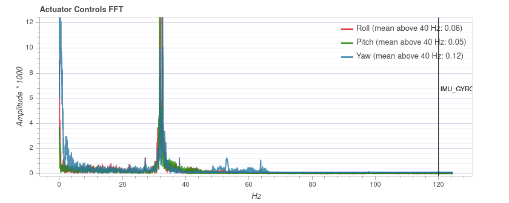

# 9. Filtering & Preprocessing of IMU + Magnetometer before EKF2 — Theory

> **Scope.** This file explains the *theory* of the signal conditioning PX4
> applies to the **calibrated** gyroscope, accelerometer, and magnetometer
> signals on their way to EKF2: integration (coning/sculling), low-pass,
> static and dynamic notch, derivative filtering, voting, and rate handling.
> The companion file [08 — Calibration theory](08_imu_mag_calibration_theory.md)
> covers what is done *before* this (removing structured bias/scale errors);
> [02 — EKF2](02_ekf2.md) covers what is done *after* (fusion). Code-level
> walkthroughs already exist in [01 — Sensors](01_sensors.md) §1.5; here the
> emphasis is on *why each stage exists and what it does to the spectrum*.

Notation per [01](01_sensors.md) §1.3. Filter parameters: $f_s$ sample rate,
$f_c$ cutoff, $f_n$ notch frequency, $BW$ notch bandwidth, $Q=f_n/BW$.

---

## 9.1. The Problem: What EKF2 Needs vs. What the Chip Delivers

EKF2 is a discrete estimator that consumes **delta-angle** and **delta-velocity**
increments (the integrals of gyro and accel over one estimator step) plus
magnetometer vectors. Two distinct problems sit between the calibrated sensor and
the estimator:

1. **Aliasing & noise.** Raw MEMS gyros on a multirotor are dominated by
   structural and aero-acoustic vibration — overwhelmingly at the **motor
   rotation frequency and its harmonics**. If this high-frequency energy reaches
   the controller it shows up as motor heating, "hot" P/D terms, and — relevant
   here — it can alias when down-sampled and inflate the apparent process noise
   EKF2 must tolerate. Gyro signals therefore get **heavy** filtering.

2. **Rate & rotation-non-commutativity.** Attitude is the integral of angular
   rate, but rotations do not commute; naïvely summing $\boldsymbol{\omega}\,dt$
   accumulates a systematic error when the rotation axis itself rotates (the
   *coning* effect). The integrator that feeds EKF2 must compensate this.

The design philosophy is asymmetric and deliberate:

| Signal | Filtering philosophy | Reason |
|---|---|---|
| **Gyro** | Aggressive: cascade of notches + low-pass + coning-corrected integration | Sits in the inner control loop *and* the estimator; vibration energy is large and structured |
| **Accel** | Light: a single low-pass + sculling-aware integration | Used mainly for the slow gravity/specific-force reference; over-filtering would add phase lag to attitude |
| **Mag** | Minimal: calibration + bias removal + time-window averaging, **no IIR low-pass** | Carries absolute heading; IIR phase lag would corrupt yaw and the signal is already slow (tens of Hz) |

---

## 9.2. The Filter Building Blocks (transfer functions)

PX4 conditions everything with a small library of fixed-form filters. Understanding
three transfer functions explains the whole pipeline.

### 9.2.1. Second-order low-pass (Butterworth biquad)

$$
H_{\text{LP}}(s)=\frac{\omega_c^2}{s^2+\sqrt{2}\,\omega_c s+\omega_c^2},
\qquad \omega_c = 2\pi f_c
$$

- A **Butterworth** response — damping $\zeta=\sqrt2/2$ — chosen for a *maximally
  flat passband* (no ripple) at the cost of a gentle −40 dB/decade rolloff.
- Discretised by the **bilinear transform** (with frequency pre-warping at $f_c$)
  into a biquad $y_k=b_0x_k+b_1x_{k-1}+b_2x_{k-2}-a_1y_{k-1}-a_2y_{k-2}$.
- Implemented in **Direct Form II** (only two state elements). Form II is fine
  here because the coefficients are *static* once $f_c$ and $f_s$ are set.

The cost of any low-pass is **phase lag** near $f_c$, which directly eats control
phase margin and adds latency to the estimator. This is why $f_c$ is a tuning
compromise, and why pushing tonal noise out with *notches* (which are local) is
preferred over simply lowering the low-pass cutoff (which is global).

### 9.2.2. Second-order notch (band-stop)

$$
H_{\text{N}}(s)=\frac{s^2+\omega_n^2}{s^2+\frac{\omega_n}{Q}s+\omega_n^2},
\qquad Q=\frac{f_n}{BW}, \ \ \omega_n=2\pi f_n
$$

- A pair of zeros on the imaginary axis at $\pm\omega_n$ gives **exact rejection
  ($|H|=0$) at $f_n$**, returning to unity gain away from it.
- $Q$ controls the trade-off: high $Q$ → narrow, deep notch with **little phase
  lag elsewhere** (precise, but only works if $f_n$ is known accurately);
  low $Q$ → wide, forgiving notch that costs more broadband phase.
- Implemented in **Direct Form I**. This matters: Form I keeps input and output
  history explicitly, so the notch frequency can be **retuned every sample**
  (for the dynamic notch) without the state corruption that re-deriving Form II
  coefficients on the fly would cause.

The notch is the right tool for multirotor noise precisely because the
disturbance is **tonal** (a spinning mass): you can surgically remove the tone
and keep almost all of the phase budget for real signal.

### 9.2.3. First-order complementary / alpha filter (EMA)

$$
y_k = y_{k-1} + \alpha\,(x_k - y_{k-1}),
\qquad \alpha = \frac{\Delta t}{\tau+\Delta t}, \ \ \tau=\frac{1}{2\pi f_c}
$$

An exponentially-weighted moving average — a cheap first-order low-pass. Used
where a full biquad is overkill (notably the angular-*acceleration* derivative).
$\alpha=1$ passes the input through; $\alpha\to0$ freezes the output.

---

## 9.3. The Gyroscope Pipeline

Processing order on the calibrated rate (each stage feeds the next):

```
calibrated ω ─▶ dynamic notch (ESC-RPM) ─▶ dynamic notch (FFT) ─▶ static notch 0
            ─▶ static notch 1 ─▶ low-pass (f_c = IMU_GYRO_CUTOFF)
            ─▶ ω̇ = backward-difference + alpha-LP (IMU_DGYRO_CUTOFF)
            ─▶ publish (angular velocity + angular acceleration)
            ─▶ coning-corrected integration ─▶ delta-angle ─▶ EKF2
```

The ordering is intentional: **notches come before the low-pass**. The notches
remove the strong tonal spikes first, so the low-pass — which mostly cleans up
the broadband floor and provides anti-alias protection before publication — does
not have to be aggressive (and thus does not have to cost much phase).

### 9.3.1. Static notches

Two manually-placed notches ($f_n$, $BW$ each configurable). Used when a vehicle
has a known fixed resonance (a frame mode, a fixed prop frequency at hover) that
does not move much with throttle. Simple, zero runtime cost beyond the biquad,
but blind to RPM changes.



*An actuator-controls FFT (PX4 log review) with a sharp tonal spike around 32 Hz on
all three axes — the signature of a structural/propeller resonance. A static notch
placed at that frequency (`IMU_GYRO_NF0_FRQ = 32`, `IMU_GYRO_NF0_BW = 5`) removes
the spike while costing almost no broadband phase, because the notch is local
(§9.2.2). Source: [PX4 User Guide — MC Filter Tuning](https://docs.px4.io/main/en/config_mc/filter_tuning.html).*

### 9.3.2. Dynamic notch — tracking the motor harmonics

The defining feature of modern multirotor gyro filtering: because **virtually all
vibration originates at the motor rotation frequency $f = \text{RPM}/60$ and its
harmonics**, a notch that *tracks* that frequency removes the disturbance with a
fraction of the phase cost of a low static low-pass. PX4 offers two ways to learn
the frequency:

- **ESC-RPM source.** When ESCs report RPM (e.g. bidirectional DShot telemetry),
  the fundamental and a configurable number of **harmonics** are computed
  directly per motor and a notch is placed on each, retuned every cycle. This is
  the most accurate source — the frequency is *measured*, not inferred.

- **FFT source.** A `gyro_fft` module maintains a sliding buffer of gyro samples,
  applies a **Hann window** (to suppress spectral leakage), takes a real FFT, and
  reports the few strongest spectral **peaks** within a configured band. The
  pipeline places a tracking notch on each peak. This needs no ESC telemetry but
  is coarser (resolution-limited bandwidth, some latency).

Both feed the *same* Direct-Form-I notch machinery (§9.2.2), which is why that
form was chosen — the centre frequency moves continuously and the filter state
must survive the change. The interplay mirrors the wider FPV/Betaflight practice:
with an accurate RPM source you can run **fewer, narrower** notches and then
**relax the low-pass cutoff** (recovering phase/latency), because the tonal energy
is already gone.

### 9.3.3. Low-pass and the angular-acceleration derivative

After the notches, one **2nd-order Butterworth low-pass** (§9.2.1) at
`IMU_GYRO_CUTOFF` cleans the broadband floor and band-limits the signal before it
is published and integrated.

The controller's rate loop also wants **angular acceleration** $\dot{\boldsymbol\omega}$
(for the D-term / feed-forward). This is produced by a **backward difference** of
the filtered rate — inherently noisy, since differentiation amplifies high
frequencies — followed by a **first-order alpha low-pass** at `IMU_DGYRO_CUTOFF`
to make it usable. This derivative path is for control, not for EKF2, but it
shares the same conditioned rate.

| Cutoff too low (40 Hz) | Cutoff well-tuned (70 Hz) |
|---|---|
|  |  |

*Effect of `IMU_DGYRO_CUTOFF` on the derivative spectrum (PX4 log review). A lower
cutoff removes more high-frequency content but adds phase lag that erodes control
margin; a higher cutoff preserves responsiveness but lets more noise through — the
classic low-pass trade-off of §9.2.1, which is why tonal energy is better removed by
notches first. Source: [PX4 User Guide — MC Filter Tuning](https://docs.px4.io/main/en/config_mc/filter_tuning.html).*

### 9.3.4. Coning-corrected integration → delta-angle

EKF2 consumes **delta-angle**, not rate. The integrator that produces it must
account for the **non-commutativity of rotations**: when the angular-rate vector
itself rotates within an integration interval, simple $\int\boldsymbol\omega\,dt$
under-rotates — the classic **coning** error, a rectified DC bias in attitude.

PX4 uses **trapezoidal integration plus a coning-correction term**:

$$
\Delta\boldsymbol\theta = \underbrace{\int\boldsymbol\omega\,dt}_{\boldsymbol\alpha\ (\text{trapezoidal})}
\;+\;
\underbrace{\tfrac12\sum_i\Big(\boldsymbol\alpha_{i-1}+\tfrac16\Delta\boldsymbol\alpha_{i-1}\Big)\times\Delta\boldsymbol\alpha_i}_{\boldsymbol\beta\ (\text{coning correction})}
$$

The cross-product $\boldsymbol\beta$ term captures the second-order rotation
coupling that trapezoidal integration misses. This is the **attitude half** of the
classical strapdown two-speed algorithm (the velocity half is *sculling*, §9.4).
Running it on the high-rate samples and only handing the *increment* to EKF2 means
the estimator can run at a far lower rate without losing attitude fidelity.

---

## 9.4. The Accelerometer Pipeline

Deliberately minimal:

```
calibrated a ─▶ (subtract EKF-estimated bias) ─▶ low-pass (IMU_ACCEL_CUTOFF)
            ─▶ publish ─▶ trapezoidal + sculling integration ─▶ delta-velocity ─▶ EKF2
```

- **One** 2nd-order Butterworth low-pass — no notches. The accelerometer feeds the
  gravity/specific-force reference, a fundamentally *low-frequency* quantity;
  high-frequency vibration on it is averaged out by the integration step anyway,
  and extra filtering would only add phase lag to the attitude solution.
- The integration to **delta-velocity** is the velocity counterpart of coning —
  **sculling** — which corrects the rectified velocity error produced when
  angular rate and specific force oscillate together in phase. Coning and sculling
  are the attitude/velocity duals of the same strapdown two-speed update.

---

## 9.5. The Magnetometer Pipeline — minimal by design

```
raw mag (×N sensors) ─▶ calibration (hard/soft-iron) ─▶ subtract learned bias
                     ─▶ power/current compensation ─▶ voter selects best sensor
                     ─▶ boxcar time-window average over SENS_MAG_RATE ─▶ publish ─▶ EKF2
```

The magnetometer is the **opposite** of the gyro: it receives almost no
filtering. Reasons, all rooted in theory:

- **It carries absolute heading.** Any IIR low-pass introduces phase lag; on a
  yaw-reference signal that lag becomes a *heading error* that scales with turn
  rate — far more damaging than the noise it would remove.
- **It is already slow.** The field changes only as fast as the vehicle rotates
  (tens of Hz at most), well below where vibration lives, so there is little
  high-frequency content to reject.
- **EKF2 does the smoothing.** The estimator fuses the mag as a low-weight
  heading aid with its own measurement-noise model; pre-smoothing would only hide
  outliers that the estimator's innovation gating handles better.

What the pipeline *does* apply is therefore **statistical, zero-phase-at-DC**, not
spectral:

- **Calibration & bias removal** (from [08](08_imu_mag_calibration_theory.md)): the
  stored hard/soft-iron correction, the online angular-rate bias estimate, and
  current compensation are subtracted.
- **Boxcar (rectangular-window) averaging** over the publication interval
  (`SENS_MAG_RATE`): samples accumulated since the last publish are simply meaned.
  This is a *finite-impulse, linear-phase* down-sampling — it reduces noise
  variance by $\sqrt{N}$ without the nonlinear phase of an IIR filter.

The contrast with the gyro is the single most important takeaway of this
document: **filter aggressively where the disturbance is tonal and the signal is
fast (gyro); filter barely at all where the signal is slow and phase-critical
(mag).**

---

## 9.6. Multi-Sensor Voting & Validation

When several IMUs or magnetometers are present, each runs its *own* full pipeline,
and a **voter** selects the primary. The voter maintains, per sensor, a confidence
metric and a set of error flags:

- **No-data / stale / timeout** — the sensor stopped or lagged.
- **High raw error count / error density** — the driver is reporting hardware
  faults.
- **Disagreement with the group** — a smoothed squared deviation from the
  **median** of the other sensors; a sensor that consistently disagrees is
  down-weighted.

Selection is priority-weighted (internal vs. external sensors have default
priorities) and fails over automatically when the current primary faults. This is
classical **fault detection & isolation / triple-modular-redundancy**: the median
gives a robust reference that a single bad sensor cannot drag, and the
innovation-style disagreement metric catches a sensor that is *self-consistent but
wrong*. For magnetometers the pipeline additionally tracks the **angle difference**
between primary and secondary as a slow complementary average, flagging
inconsistency before it corrupts heading.

---

## 9.7. Sample-Rate Handling and the EKF2 Hand-off

Three rates coexist and must be reconciled:

1. **Raw chip rate** — up to ~1–8 kHz, often delivered as a **FIFO burst** of
   several samples per driver callback. Filtering and integration run at this
   rate (array-applied over the burst) so that nothing is aliased before the
   notches act.
2. **Publication rate** — the conditioned angular velocity / acceleration is
   published at a bounded rate (`IMU_GYRO_RATEMAX`) for the controllers.
3. **Integration / EKF2 rate** — the delta-angle and delta-velocity integrators
   **reset and emit at `IMU_INTEG_RATE`**, which sets the cadence EKF2 sees.

Because gyro and accel can have *different* raw rates, the integrators are reset
**synchronously**: the accelerometer integral is "back-sampled" / chased to the
gyro's integration boundary so the two increments share a common time window and
EKF2 receives a consistent $(\Delta\boldsymbol\theta,\Delta\boldsymbol v)$ pair.
Latency is monitored so the estimator is never fed stale increments.

**Clipping** is also surfaced here: when a raw sample saturates the sensor range
(hard impacts, extreme vibration) the event is counted, rotated into body frame,
and flagged in the increment handed to EKF2 — which can then inflate its noise or
reject that update, because a clipped sample violates the linear measurement model
the whole pipeline assumes.

The architectural point: **all the high-rate, computationally heavy
signal-processing lives below EKF2**, which receives clean, band-limited,
coning/sculling-correct increments at a modest rate. This is what lets a complex
24-state estimator run in real time on a flight controller.

---

## 9.8. End-to-End Summary

| Signal | Stages (in order) | Filter types | Output to EKF2 |
|---|---|---|---|
| **Gyro** | dyn-notch (RPM) → dyn-notch (FFT) → static notch ×2 → LP → coning integrate | Direct-Form-I notches, Direct-Form-II Butterworth, trapezoidal + coning | delta-angle |
| **Accel** | LP → sculling integrate | Direct-Form-II Butterworth, trapezoidal + sculling | delta-velocity |
| **Mag** | calibrate → bias subtract → current comp → vote → boxcar average | linear-phase window only (no IIR) | field vector |

Three principles tie it together:

1. **Match the filter to the disturbance.** Tonal motor noise → tracking notches;
   broadband floor → gentle Butterworth; phase-critical slow signal → almost
   nothing.
2. **Do the kinematically-correct integration low in the stack.** Coning and
   sculling corrections let EKF2 run slowly without attitude/velocity rectification
   error.
3. **Hand EKF2 exactly what its model assumes** — band-limited, unbiased,
   time-consistent increments with explicit clipping/validity flags — so its
   white-noise, linear-measurement assumptions hold as well as physically
   possible.

---

## 9.9. Theoretical Background & Keywords

| Topic | Keywords for deeper study |
|---|---|
| Strapdown integration | `coning compensation`, `sculling`, `two-speed update`, `Bortz equation`, `Savage strapdown algorithms`, `rotation-vector update` |
| IIR filter design | `biquad`, `bilinear transform`, `Butterworth`, `Direct Form I vs II`, `pre-warping`, `notch / band-stop` |
| Tonal-noise rejection | `RPM / dynamic notch filter`, `motor-harmonic tracking`, `bidirectional DShot`, `Q factor`, `Betaflight RPM filter` |
| Spectral estimation | `windowed FFT`, `Hann window`, `spectral leakage`, `peak detection` |
| Anti-alias / rate | `Nyquist`, `decimation`, `back-sampling`, `FIFO burst` |
| Redundancy | `sensor voting`, `median fault detection`, `FDI`, `triple modular redundancy` |

### Recommended reading
- Savage, P. G. — *Strapdown Inertial Navigation Integration Algorithm Design,
  Part 1 (Attitude)* and *Part 2 (Velocity & Position)*, J. Guidance, Control &
  Dynamics. (coning/sculling two-speed algorithms — the basis of PX4's integrator).
  [Part 1 / Part 2 (AIAA)](https://arc.aiaa.org/doi/10.2514/2.4242)
- Savage, P. G. — *Computational Elements for Strapdown Systems* (NATO/RTO
  lecture notes).
  [PDF](https://publications.sto.nato.int/publications/STO%20Educational%20Notes/RTO-EN-SET-116-2009/EN-SET-116(2009)-09.pdf)
- ArduPilot — *Managing Gyro Noise with Dynamic Harmonic Notch Filters*
  (practitioner's treatment of RPM/dynamic notch tuning).
  [docs](https://ardupilot.org/copter/docs/common-imu-notch-filtering.html)
- Oscar Liang / UAVMODEL — *RPM Filtering & Dynamic Notch* (intuition for Q,
  harmonic count, and relaxing the low-pass once tonal noise is removed).
  [RPM filter guide](https://oscarliang.com/rpm-filter/)
- Titterton & Weston, *Strapdown Inertial Navigation Technology*, ch. 11
  (coning/sculling); Groves, *Principles of GNSS, Inertial, and Multisensor
  Integrated Navigation* (sensor processing & integration).

> **See also:** [08 — Calibration theory](08_imu_mag_calibration_theory.md) (what
> happens *before* this stage) · [01 — Sensors](01_sensors.md) (code-level
> walkthrough) · [02 — EKF2](02_ekf2.md) (fusion of these increments).
